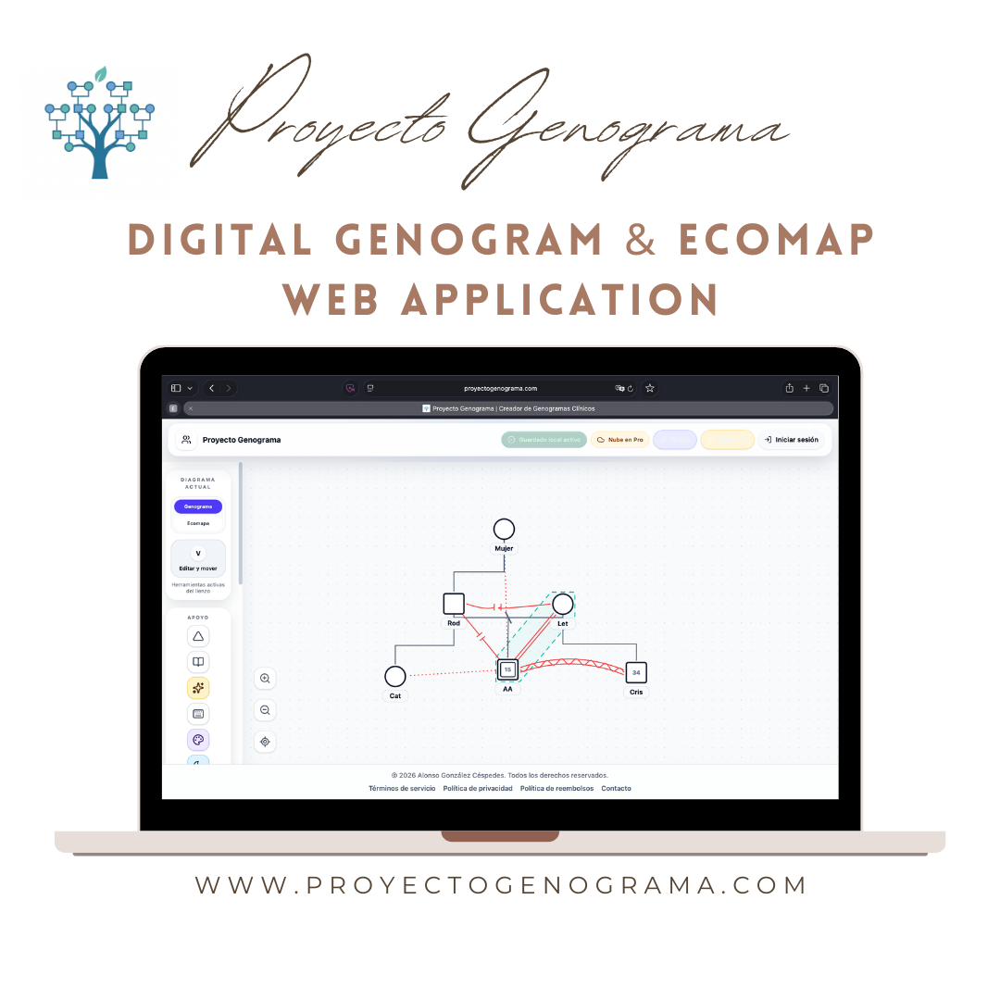
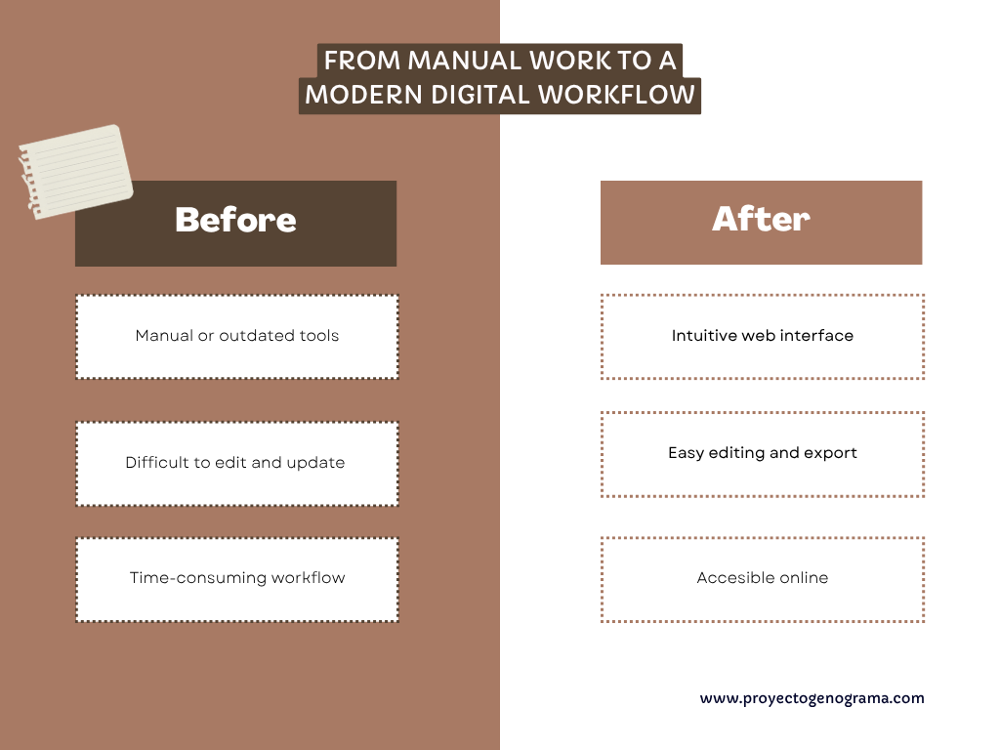
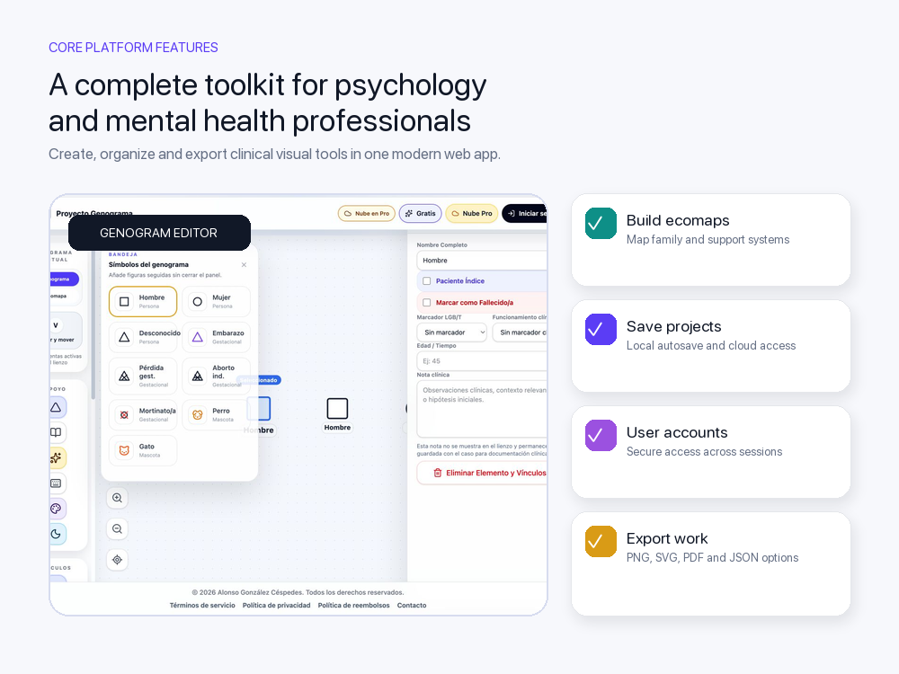
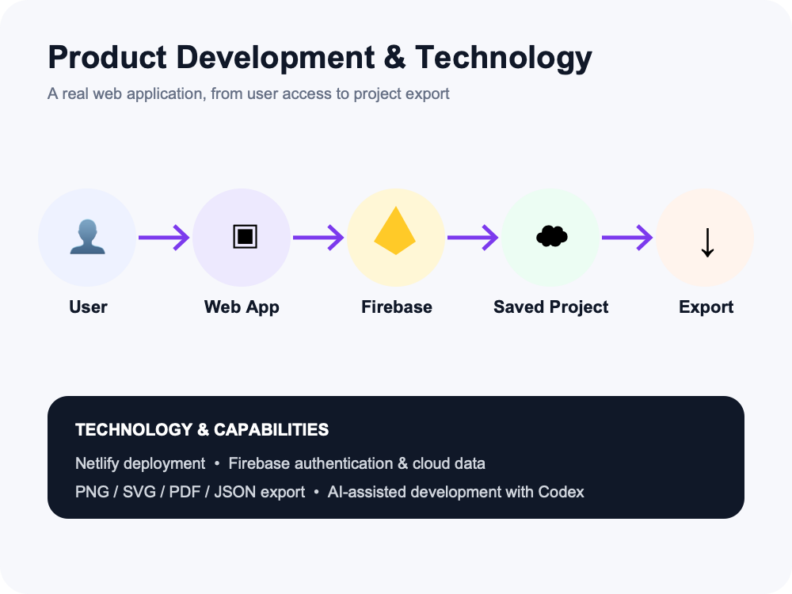
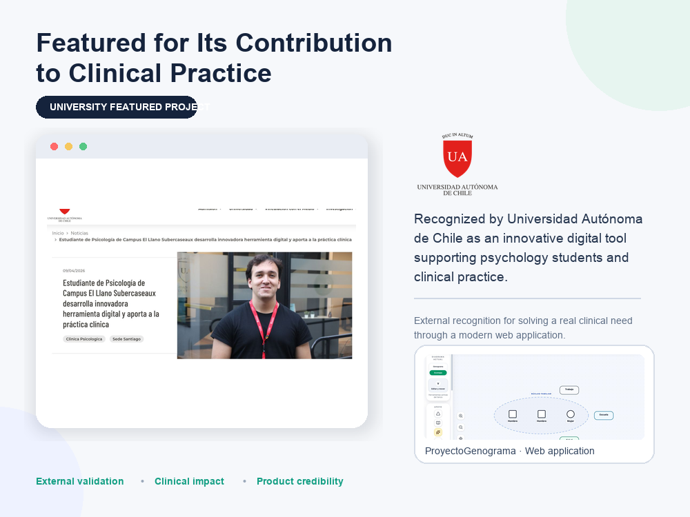

# ProyectoGenograma

## Digital Genogram and Ecomap Web Application

ProyectoGenograma is a web application designed to make creating genograms and ecomaps more accessible for psychology and mental health professionals. It replaces difficult or outdated workflows with a modern interface for creating, editing, saving, and downloading professional diagrams.

🌐 [Visit the live application](https://proyectogenograma.com)

## The problem

Psychology professionals and students often need to represent family structures, relationships, and social support networks during clinical and educational work. Traditional methods can be time-consuming, difficult to update, or dependent on outdated software.

## The solution

I designed and developed a browser-based tool that allows users to create and manage digital genograms and ecomaps through a clearer and more accessible workflow.

## Main features

- Digital genogram creation
- Ecomap creation
- User registration and authentication
- Cloud-based project storage
- Project editing and management
- Download and export options
- Responsive, accessible web interface
- Subscription system currently in development

## Technology

- Firebase for authentication and cloud data storage
- Netlify for hosting and deployment
- AI-assisted product development with Codex

## My role

I created the project from the initial idea and remain responsible for:

- Product planning
- User experience decisions
- Development and implementation
- Testing and deployment
- Maintenance and continuous improvement

## Project status

The application is live and actively maintained. I am currently developing a subscription system as part of its evolution into a sustainable SaaS product for psychology professionals.

## External recognition

Universidad Autónoma de Chile featured ProyectoGenograma for its contribution to psychology training and clinical practice.

[Read the university feature](https://www.uautonoma.cl/noticias/estudiante-de-psicologia-de-campus-el-llano-subercaseaux-desarrolla-innovadora-herramienta-digital-y-aporta-a-la-practica-clinica/)

## Source code

This repository is a public case study. The production source code and user data are not included.
